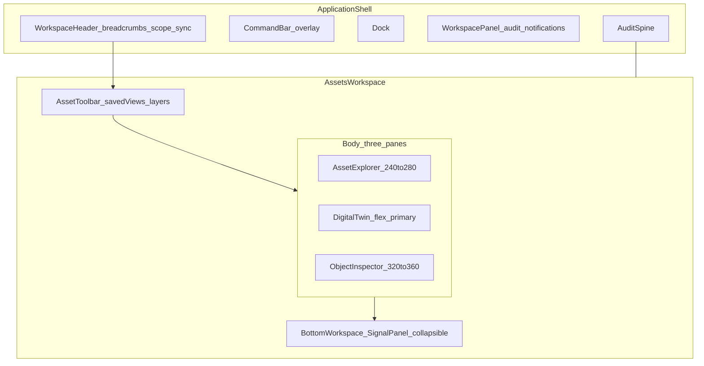

# Assets Workspace Redesign — Industrial OS Spec

**Mode:** Design only. No React. No CSS. Forget preserving the current UI.

**Default deliverable after approval:** write this spec as [`docs/ASSETS_WORKSPACE_REDESIGN.md`](docs/ASSETS_WORKSPACE_REDESIGN.md) (design contract only).

---

## Part A — Brutal audit of the current Assets page

What exists today (mental model of [`AssetConsole.jsx`](frontend/src/redesign/views/AssetConsole.jsx)):

```
[hero title] → [Filters (dead) + sort]
[long flat explorer] | [decorative SVG + ≤5 nodes] | [inspector stack]
[bottom tab strip with 8 mostly empty tabs + one chart]
```

### What wastes screen space
- **Product hero** above the workspace (“Critical assets” + prose) — marketing, not operations. Steals vertical pixels every visit.
- **Twin workspace head** (“DIGITAL TWIN WORKSPACE / Alpha refinery - live asset graph”) duplicates shell breadcrumbs and facility scope.
- **Bottom strip of 8 tabs** always present even when most are inert — permanent chrome with one real panel.
- **Inspector metric grid** (6+ numeric cells) without thresholds or time — dense but low signal.
- **Canvas footer** (“connected assets / telemetry 4 sec ago / linked incidents”) — status that belongs in SyncIndicator / OperationsStrip, not a second footer.

### What feels decorative
- Twin SVG pipes/tanks/pumps with **no binding to real process topology**.
- Orbit empty-state animation.
- Map legend Nominal/Watch/At risk that does not drive filtering.
- Health bar / prediction bar without provenance of the model.

### What feels fake
- **Filters** button — no filter panel.
- Bottom tabs: Sensor history, Maintenance, Knowledge, Forecast, Incidents, Documents, AI summary — **labels only**.
- “telemetry updated 4 sec ago” — hardcoded copy.
- Zoom control that only scales CSS on a static illustration.
- Only **five** map nodes for an entire facility.
- Predicted failure + AI recommendation blocks that look authoritative without lineage to TracePanel/evidence.

### What requires too much scrolling
- Flat explorer list of every asset with weak grouping.
- Inspector stacks Identity → State → Signals → Links → Actions **vertically forever**.
- Bottom workspace + inspector + twin compete for height; operator scrolls the page, not a pane.

### Poor hierarchy
- Title weight competes with selected asset name.
- Risk number, health %, badges, and recommendation all shout at the same level.
- Explorer “Group: location|type” is a toggle buried under search — hierarchy is an afterthought.
- Twin is visually centered but informationally empty → hierarchy lies.

### False affordances (imply function that doesn’t exist)
- Filters, MoreHoriz menus, bottom tabs beyond Telemetry, Fullscreen, “Documents”, “AI summary”.
- Create work order / Open incident exist; most chrome around them does not.

### Should be merged
- Hero + twin head + facility crumb → **one WorkspaceHeader / breadcrumb**.
- Sort + Filters + Group → **Saved views + filter chip bar**.
- Inspector prediction + recommendation + actions → **Decision / Next action rail** (one CTA max).
- Canvas footer sync age → shell SyncIndicator.

### Should disappear entirely
- Marketing hero on Assets.
- Decorative twin illustration as the “product”.
- Empty bottom tabs until backed by data.
- Hardcoded “4 sec ago”.
- Orbit empty animation as primary empty state.
- Duplicate “View forecast” buttons.
- Non-functional Filters / More menus (or make them real — until then, remove).

**Verdict:** Today’s Assets page is a **three-column demo dashboard with a poster twin**. It is not an industrial operating surface.

---

## Part B — Purpose

### Primary users
1. **Control room operator** (shift) — detect, localize, decide containment.
2. **Reliability / maintenance planner** — condition → work order.
3. **Process engineer** (secondary) — relationships, history, simulation.
4. **AI investigation consumer** — verify agent claims against twin + tags (not a separate mental model).

### Primary workflows
1. Scan facility → find abnormal unit → select equipment → confirm signals → open incident or create WO.
2. From incident/investigation → land on same asset in twin with selection preserved.
3. From forecast → stage maintenance draft without leaving asset context.
4. Bookmark critical trains for shift handover.

### Primary decisions
- Is this asset **safe to run / watch / intervene**?
- Is the alarm **process, equipment, or sensor**?
- Do I **acknowledge, escalate to incident, or schedule maintenance**?
- Which **downstream units** are exposed?

### Operator goals
- Orient in **&lt;10 seconds**.
- Never lose facility/unit/asset context.
- See **where** on the process before reading a table.
- One primary next action.

### AI goals
- Surfacing **why** (evidence + confidence + provenance) next to the object — never a floating chatbot as the main UI.
- Ranking explorer and twin overlays by **modelled risk**, not decoration.
- Drafting WO / investigation links with full audit trail.

---

## Part C — Workspace layout (complete)

Reference layout family: **ExplorerLayout** (Foundry Ontology explorer + PI Vision canvas + Forge asset pane).



### Regions (every region specified)

| Region | Purpose | Priority | Width | Collapse | Sticky | Scroll | Keyboard | Interactions |
|--------|---------|----------|-------|----------|--------|--------|----------|--------------|
| **Context breadcrumbs** | Facility › Assets › Unit › Asset › Tag | P0 | full | never | in header | no | crumb activate | click crumb = navigate + preserve selection |
| **Top toolbar (Asset)** | Saved view, layer toggles, search scope, create WO | P0 | full | never | under header | no | toolbar tab stop | change view = explorer+twin+overlays update together |
| **Explorer** | Hierarchical find + queues | P0 | 240–280px; &lt;1024 as tab | to icons+rail 64px | pane header sticky | **independent** | list arrows; Enter select | select = in-place; pin/favorite; open incident badge |
| **Digital Twin** | Primary spatial truth | **P0 primary** | `1fr` (min 50% desktop) | never on desktop; mobile tab | toolbar sticky | pan/zoom canvas; no page scroll | focus canvas; arrows nudge selection among neighbors | click node/tag = select; right-click context; layer toggles |
| **Object Inspector** | Object dossier | P0 | 320–360px | to 0 with `]` shortcut; peek mode | section headers sticky | **independent** | first actionable after select | section accordions; links navigate with ID |
| **Bottom workspace** | Time-series & related records | P1 | full under twin+inspector or under all three | height 0 / 28% / 45% (`Ctrl+B`) | tab bar sticky | **independent** horizontal tabs + chart scroll | tab list arrows | tab change does **not** clear selection |
| **Command bar** | Global go-to asset/tag/incident | P0 | modal | overlay | — | list | ⌘K | result → Assets + select |
| **Audit spine** | Last decisions | P1 | full 32px | never | bottom sticky | horizontal | ⌘⇧A | click → related object |
| **Workspace panel** | Audit/notifications — **not** object context | P2 | 400px drawer | ⌘J | — | yes | focus trap | never duplicates ObjectInspector |

**Rule:** Page itself does not scroll. Only Explorer, Twin viewport, Inspector, Bottom pane scroll independently (XHQ / Foundry pattern).

---

## Part D — Digital Twin (answers + design)

Must answer continuously on-canvas:

| Question | Twin encoding |
|----------|----------------|
| **What is happening?** | Live tag values on selected train; streaming spark at node; alarm badges |
| **Why?** | On select: causal strip (“deviation vs baseline”, linked agent finding chip) — detail in Inspector/Bottom |
| **Where?** | Process flow position + unit highlight + minimap |
| **How severe?** | Risk heatmap fill + alarm severity ring (critical pulse 400ms only) |
| **What should I do?** | Single Primary CTA on twin chrome + Inspector actions |

### Twin capabilities (required)
- **Process flow** schematic per unit (P&ID-lite): vessels, pumps, exchangers, lines with flow direction.
- **Animated telemetry** on edges (velocity tied to flow tag) and node fill (health/risk).
- **Equipment selection** — single select; multi-select later for compare (phase 3).
- **Heatmaps** — risk / health / deviation modes (mutually exclusive layer).
- **Alarm overlays** — unacked / acked states from incident bus.
- **Risk overlays** — model score 0–100 banded.
- **Sensor overlays** — show/hide TagOverlay pins.
- **Pipeline flow** — directional particles; stop/slow on blocked path.
- **Status animation** — only critical/attention dots (Part 8 rule).
- **Context menus** — Open incident, View forecast, Create WO, Pin, Copy tag, Show in explorer.
- **Selection** — explorer row + inspector + bottom series + breadcrumb object crumb update **together**.
- **Zoom / pan** — wheel + space-drag; fit-to-unit; fit-to-selection.
- **Minimap** — corner overview; click to pan.
- **Layers** — Process / Risk / Alarms / Sensors / Maintenance windows (checkboxes in toolbar).
- **Tag overlays** — PI Vision-style; click tag selects asset or focuses Bottom Telemetry.

**Remove:** static decorative SVG that isn’t a topology model.

---

## Part E — Object Inspector

Ordered sections (always this order; collapse secondary by default):

1. **Identity** — name, tag, class, location path, ProvenanceBadge  
2. **Current health** — StatusBadge, RiskBadge, HealthRing, last inspection  
3. **Signals** — Sparkline + top 3 SignalCards (threshold-aware)  
4. **Linked incidents** — open cases chips → Incident Center  
5. **Forecast** — RUL / failure probability + deep link  
6. **Maintenance** — open/draft WOs + Create WO  
7. **Knowledge** — procedures / similar past events (retrieval hits)  
8. **Documents** — controlled docs count + open  
9. **Operator notes** — shift notes (persisted)  
10. **AI recommendations** — text + confidence + “Open investigation” (lineage)

**One PrimaryCTA** visible: context-dependent (Open incident | Create WO | Acknowledge watch).

---

## Part F — Bottom Workspace tabs (ideal)

Keep **few live tabs**; hide empty.

| Tab | Role | Default |
|-----|------|---------|
| **Telemetry** | Historian for selected tags | **On** |
| **History** | State changes, acknowledgements | On |
| **Incidents** | Cases for this asset | On if count&gt;0 |
| **Forecast** | Curve for selection | On |
| **Maintenance** | WO timeline | On |
| **Relationships** | Upstream/downstream graph | On |
| **Knowledge** | Procedures / similar | Lazy |
| **Documents** | Files | Lazy |
| **Simulation** | What-if (shares Forecast scenario model) | Phase 2 |

**Remove as permanent chrome:** “AI summary” as its own tab (fold into Inspector AI + Investigation).

---

## Part G — Asset Explorer redesign

Replace flat list with **ontology tree + smart queues** (Azure Industrial / Foundry):

```
Search (tag, name, area)
Saved views: [Shift Critical] [My Pins] [Open Alarms] [Unit: Crude]
────────────────────────────────
▾ Favorites
▾ Critical now (risk≥threshold or open incident)
▾ Open incidents (asset chips)
▾ Recent (session)
────────────────────────────────
▾ Facility
   ▾ Area / Unit
      ▾ System
         Equipment (status dot, health, incident pip)
```

- **Hierarchy** — Facility → Area → Unit → System → Asset (data-driven).  
- **Grouping** — saved view defines group key; not a random toggle.  
- **Favorites / bookmarks** — local + server pin.  
- **Critical assets** — always above tree when non-empty.  
- **Recent** — last 10 selections.  
- **Open incidents** — queue jumping into twin selection.  
- **Search** — filters tree; Enter selects first match + fits twin.  
- **Filtering** — severity, type, health band, has-incident (FilterChipBar).  
- **Saved views** — named filter+layer+unit camera presets.  
- **Collapse rules** — expand path to selection; collapse siblings; remember per view.  
- **Bookmarks** — same as favorites; appear in CommandBar.

---

## Part H — Interaction: click an asset

Exact coupling (no mental context change):

| Surface | Update |
|---------|--------|
| **Explorer** | Row selected; ancestors expanded; others dimmed optional |
| **Twin** | Node selected ring; camera ease to node 200ms; tag overlay for asset; neighbors remain visible |
| **Inspector** | Crossfade 200ms to sections 1–10 for that ID |
| **Telemetry (Bottom)** | Series swap to asset’s primary tags; brush preserved if same unit |
| **Breadcrumbs** | `… › Assets › {Unit} › {Asset}` |
| **Audit** | No new entry (selection ≠ decision) |
| **Keyboard focus** | Moves to Inspector first actionable (or stays in explorer if arrow-navigating) |

Click **tag** on twin: select owning asset + Bottom focuses that tag.  
Click **alarm badge**: select asset + Bottom → Incidents + optional navigate to case (modifier).  
**Right-click** asset: context menu only — no route change.

---

## Part I — Challenge existing widgets (dispose / move / merge)

| Current | Action |
|---------|--------|
| Product hero | **Remove** from Assets |
| Twin marketing title block | **Remove**; use WorkspaceHeader |
| Filters dead button | **Remove** or replace with real FilterChipBar |
| Sort-only dropdown | **Merge** into Saved views |
| Decorative SVG twin | **Replace** with topology twin |
| Canvas footer stats | **Move** to SyncIndicator / toolbar |
| 8 empty bottom tabs | **Remove** until data; start with Telemetry+History+Incidents |
| Duplicate forecast buttons | **Merge** to one CTA |
| Inspector 6 flat metrics | **Merge** into Signals (threshold SignalCards) |
| Hardcoded sync copy | **Remove** |
| MoreHoriz noop | **Remove** |

---

## Part J — Deliverables

### 1. Wireframe specification (desktop)

```
┌─ Shell header: scope | breadcrumbs | sync | AI status | ⌘K ─────────────┐
├─ Asset toolbar: SavedView | Layers[Process Risk Alarms Sensors] | Fit | WO ─┤
├─ Explorer 260 ─┬─ Twin (flex, minimap, overlays) ──────┬─ Inspector 340 ─┤
│ queues+tree    │ process flow + selection + tags        │ sections 1–10   │
│                │                                        │ PrimaryCTA      │
├────────────────┴──────────────────┬─────────────────────┴────────────────┤
│ Bottom: [Telemetry|History|Incidents|Forecast|Maint|Rel]  chart/table   │
├──────────────────────────────────────────────────────────────────────────┤
│ AuditSpine ──────────────────────────────────────────────────── Dock FAB │
└──────────────────────────────────────────────────────────────────────────┘
```

Mobile &lt;1024: tabs **Explorer | Twin | Inspector**; Bottom as sheet.

### 2. Information hierarchy
1. Facility scope + selected object path  
2. Twin spatial state (what/where/severity)  
3. Explorer queues (what needs me)  
4. Inspector identity + health + next action  
5. Bottom time evidence  
6. Audit / notifications  

### 3. Interaction flow
Scan twin overlays → select → confirm signals in Bottom → PrimaryCTA (incident/WO/ack) → AuditSpine entry on decision only.

### 4. Component list (catalog-aligned)
WorkspaceHeader, ScopeSwitcher, SyncIndicator, Toolbar, FilterChipBar, SavedViewSelect, AssetTree, AssetTreeNode, SmartQueue (Critical/Recent/Incidents), ProcessSchematic, TwinNode, TagOverlay, LayerToggleBar, MiniMap, ObjectInspector, SectionHeader, StatusBadge, RiskBadge, HealthRing, SignalCard, Sparkline, ProvenanceBadge, PrimaryCTA, SignalPanel (Bottom), CommandBar, AuditSpine, WorkspacePanel, Dock, ContextMenu, EmptyState.

### 5. Layout diagram
See mermaid above; pane widths per DESIGN_SYSTEM ExplorerLayout: explorer ~240–280, inspector ~320–360, twin flex.

### 6. Implementation phases (design → build later)

| Phase | Scope |
|-------|--------|
| **0 Contract** | Publish this doc; freeze ObjectContext fields for pins, saved views, twin camera |
| **1 Chrome** | Kill hero; Asset toolbar; pane scroll model; real FilterChipBar |
| **2 Explorer** | Hierarchy + Critical/Recent/Favorites/Open incidents + saved views |
| **3 Twin** | Topology-bound schematic, layers, minimap, tag overlays, selection camera |
| **4 Inspector** | Full section model; single PrimaryCTA; notes |
| **5 Bottom** | Telemetry+History+Incidents wired; hide empty tabs |
| **6 Polish** | Context menus, bookmarks in ⌘K, Simulation tab, multi-select compare |

---

## Design principles (non-negotiable)
- Twin is the **primary workspace**, not a chart beside a list.
- No page scroll; pane scroll only.
- No false affordances.
- Selection never clears on tab change.
- AI explains on the object — it does not replace the twin.
- Feels like **Palantir + PI Vision**: ontology left, living process center, dossier right, historian below.

---

## Design QA lock (must pass before build)

Honest answers against **this redesign**, not today’s UI. Soft spots in the first draft are hardened below.

### 1. Is the Digital Twin big enough?
**Not yet — unless we lock geometry.** A 320–360px inspector + 260px explorer + bottom sheet can still starve the twin.

**Lock:**
- Twin viewport ≥ **55% of content width** and ≥ **50% of viewport height** with Bottom collapsed.
- Default Bottom height = **28%**; never open Bottom at 45% as default.
- Explorer max **260px**; Inspector default **320px**, collapsible to **0** with `]` (peek on hover optional).
- Twin is the only pane allowed to grow when the window grows.

### 2. Is there still wasted space?
**Yes, if we keep marketing chrome or always-on Bottom.** The redesign kills the hero, but risk remains: tall inspector sections, empty tabs, duplicate titles.

**Lock:**
- No Assets hero. No twin marketing title. No canvas footer stats.
- Inspector: only Identity + Health + Signals + PrimaryCTA expanded by default; rest collapsed.
- Bottom tabs render only when that object has data (or Telemetry always).
- Toolbar is one 40px row — no second title band.

### 3. Does the explorer scale to 10,000 assets?
**No — a plain tree of 10k DOM nodes fails.** Queues + hierarchy alone are not enough.

**Lock (enterprise requirement):**
- Virtualized tree (windowed rows) — never mount 10k nodes.
- Default view = **Critical + Open incidents + Recent + Favorites**, not full facility expand.
- Full hierarchy loads **lazy by unit**; search hits server/index, not client filter of 10k.
- Saved views are the primary navigation for large fleets; “show all” is an explicit action.
- Twin shows **unit-scoped topology** (hundreds of nodes max), not 10k equipment glyphs at once.

### 4. Is the inspector too tall?
**Yes if all 10 sections are open.** That recreates today’s scroll trap.

**Lock:**
- Default expanded: Identity, Health, Signals, **one** PrimaryCTA.
- Linked / Forecast / Maintenance / Knowledge / Documents / Notes / AI = accordion, closed.
- Inspector pane scrolls **internally**; sticky section: Identity + CTA rail at bottom of inspector.
- Hard budget: above-the-fold inspector ≤ **viewport − header − audit − bottom(collapsed)**.

### 5. Can an operator work without scrolling?
**Yes for the primary path — only if page scroll is forbidden.** Pane scroll for deep evidence is OK.

**Primary path without page scroll:**
1. See risk/alarm on twin → 2. Click asset → 3. Read health + 3 signals → 4. Hit PrimaryCTA.

**Allowed pane scroll:** explorer list, inspector secondary sections, bottom historian.
**Forbidden:** document/body scroll on Assets.

### 6. Is the workflow obvious?
**Only if the twin carries the story.** Lists-first = not obvious.

**Lock the happy path in chrome:**
- Empty twin state copy: “Select a critical asset or click a unit.”
- Critical queue always visible above tree.
- One PrimaryCTA label that names the act: `Open incident` / `Create work order` / `Acknowledge watch`.
- Breadcrumb always shows Unit › Asset so “where” is never ambiguous.

### 7. Does it actually feel like an operating system?
**Not automatically.** Layout ≠ OS. OS feel = object permanence, keyboard, no false chrome, decisions audit, twin as spatial truth.

**OS checklist (fail any → redesign):**
- [ ] Selection survives route changes
- [ ] ⌘K finds asset/tag; arrows drive explorer; `]` toggles inspector; `Ctrl+B` bottom
- [ ] Zero dead buttons
- [ ] Decisions write AuditSpine; selections do not
- [ ] Twin is unit topology + layers, not illustration
- [ ] No marketing hero on operational routes

### Geometry summary (1440×900 reference)

| Pane | Width | Height note |
|------|-------|-------------|
| Explorer | 240–260px | full body; virtualized |
| Twin | flex ≥55% | ≥50% vh with Bottom at 28% or collapsed |
| Inspector | 320px (collapsible) | internal scroll; CTA sticky bottom |
| Bottom | full | default 28%, toggle 0/28/45 |
| Page | — | **overflow: hidden** |
