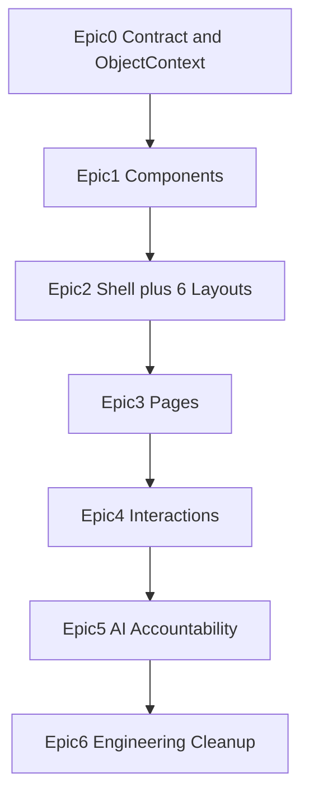

# RigOS Enterprise Product Design & Implementation Roadmap

Deliverables on approval:
- `DESIGN_SYSTEM.md` — design language, layouts, components, **interaction model**
- `PRODUCT_AUDIT.md` — operator audit + per-page analysis

---

## Implementation sequence (Epics)

Build order is strict: **contract → components → layouts → pages → interactions → AI trust → engineering**. No page redesign until Epics 0–2 are complete.

> **Architect gate:** See Part 9. Resolve blockers B1–B6 before Epic 1.

### Epic 0 — Contract freeze (NEW — required before Epic 1)

**Status: COMPLETE**

Deliverables published:

| Artifact | Path |
|----------|------|
| Design system contract | [`docs/DESIGN_SYSTEM.md`](docs/DESIGN_SYSTEM.md) |
| Product audit | [`docs/PRODUCT_AUDIT.md`](docs/PRODUCT_AUDIT.md) |
| ObjectContext spec | [`docs/OBJECT_CONTEXT.md`](docs/OBJECT_CONTEXT.md) |
| Data contract | [`docs/DATA_CONTRACT.md`](docs/DATA_CONTRACT.md) |
| ObjectContext code | `frontend/src/context/ObjectContext.jsx`, `objectNavigation.js`, `breadcrumbs.js` |
| Design-system migration | `frontend/src/design-system/README.md` (extend, not fork) |

Resolved:

- [x] ObjectInspector vs WorkspacePanel naming (B1)
- [x] ObjectContext store + navigateTo + breadcrumbs (B2)
- [x] ForecastLayout → ExplorerLayout `canvasVariant="forecast"` (B3)
- [x] UnitRiskMap + DecisionQueue in catalog (B4)
- [x] Extend existing `design-system/` (B5)
- [x] Parts 4–6 + interaction model in DESIGN_SYSTEM.md (B6)
- [x] Preview tool = Storybook (Epic 1)
- [x] Scope = client-side filter documented

**Exit criteria:** Architect score ≥ 90; blockers B1–B6 closed. → See Part 9 re-review.

---

### Epic 1 — Build the actual Design System ⭐⭐⭐⭐⭐

**Status: COMPLETE**

**Goal:** Presentational catalog in `frontend/src/design-system/catalog/` — zero page composition.

**Shipped:**
- Tokens extended (`statusColors`, control-room typography, pane widths)
- Full catalog layers: shell, data, objects, investigation, time, twin, panels, actions, executive
- `catalog.css` + `motion.css` wired from `App.jsx`
- Isolated preview at **`/__catalog`**
- Public exports via `design-system/index.js` (catalog primary; legacy as `Legacy*` / `V2*`)

**Exit criteria:** met (preview gallery, light/dark, reduced-motion CSS, no page rebuild).

---

### Epic 2 — Build the reusable layouts ⭐⭐⭐⭐⭐

**Status: COMPLETE**

**Shipped:**
- 6 slot layouts in `frontend/src/design-system/layouts/`
- `ApplicationShell` (nav, header, WorkspacePanel ⌘J, Dock, CommandBar, AuditSpine)
- `layouts.css` — grids, sticky regions, &lt;1024px tab mode
- Preview at **`/__layouts`** (placeholders only, no API)
- Forecast uses `ExplorerLayout` + `canvasVariant="forecast"`

**Exit criteria:** met. Product routes use legacy `ProductShell` / `ProductPage` (Epic 3 undone / not shipping).

---

### Epic 3 — Rebuild pages using ONLY layouts + components ⭐⭐⭐⭐⭐

**Status: CANCELLED / NOT SHIPPING**

Epic 3 page compositions and adapters were removed from the product surface. Live app is back on `ProductShell` + `ProductPage`. Catalog + layouts from Epics 1–2 remain on disk for later reuse.

**Exit criteria:** n/a (undone).

---

### Epic 4 — Wire interactions ⭐⭐⭐⭐ ✅

**Goal:** Workflow unification. UI is stable; now connect objects across workspaces.

**Shipped on ProductShell / ProductPage** (Epic 3 catalog pages not remounted):
- `ObjectProvider` + `navigateTo` / facility filters / breadcrumbs
- Cross-links: Command→Assets/Incidents/Investigation/Maintenance/Reports; Twin→Forecast/WO/Incident; Incident→Twin/Investigation; Forecast→draft WO; Investigation↔Incident; Reports→Evidence appendix
- Global ⌘/Ctrl K search (assets, incidents, WOs, reports) with ↑↓/Enter; ⌘/Ctrl J panel; Escape closes overlays; queue arrow keys
- Selection + draft WO persist in session (`ObjectContext`)

**Exit criteria:** met for Interaction Model paths above.

---

### Epic 5 — AI accountability ⭐⭐⭐⭐ ✅

**Goal:** The feature that distinguishes RigOS from generic dashboards.

**Shipped on ProductShell / ProductPage** (`frontend/src/redesign/accountability.jsx`):
- **Agent Trace** — TracePanel on AI Investigation (inputs, outputs, model ID, duration)
- **Evidence lineage** — linked fact chips on Incidents + Investigation
- **Provenance badges** — Live / Estimated / Stale on metrics, inspector, forecast, investigation
- **Mandatory rationale** — DecisionBar blocks submit until ≥20 chars; API `note` min_length=20
- **Immutable audit log** — sticky AuditSpine + session `pushAuditDecision`; CSV export from Command Center / ⌘K / spine Export
- **Decision history** — inspector sections + Executive ApprovalStamp chain

**Exit criteria:** met.

---

### Epic 6 — Engineering cleanup ⭐⭐⭐ ✅

**Goal:** Production hardening — **only after** UI and interactions are stable.

**Shipped:**
- **Lazy loading** — `ProductPage` + `src/redesign/views/*` (one chunk per workspace)
- **A11y** — skip link, `#main-content`, breadcrumb `aria-current`, command/palette labels
- **Performance** — Vite `manualChunks` (react/mui/motion/utils), CSS trim, `PERFORMANCE.md`
- **E2E smoke** — Playwright `e2e/workspaces.spec.js` (9 tests) via `npm run test:e2e`
- **Dead code** — removed unused view monolith; dropped `@mui/lab`, `socket.io-client`, `recharts`; legacy CSS imports removed
- **Tokens** — catalog.css + tokens remain canonical for new UI

**Exit criteria:** met (`npm run build` + `npx playwright test` green).

---

## Part 8: Interaction Model ⭐⭐⭐⭐⭐

Yes — this is essential. Epic 4 implements exactly this spec. Every interaction answers eight questions:

1. What happens on click?
2. How does the Inspector change?
3. How do breadcrumbs behave?
4. Which panel updates?
5. What is animated?
6. What is sticky?
7. What receives keyboard focus?
8. In-place vs navigate away?
9. What persists across pages?

---

### Global shell behavior

| Element | Sticky? | Focus | Persists |
|---------|---------|-------|----------|
| **WorkspaceHeader** | Yes (top) | On route change, focus moves to page title (h1) | Scope badge, sync age |
| **OperationsStrip** | Yes (below header, Command Center only) | Tab order: KPI1→KPI4→CTA | — |
| **AuditSpine** | Yes (bottom, 32px) | Not in default tab order; ⌘⇧A to focus | Last 5 decisions (session + server) |
| **Dock** | Fixed bottom-right | ⌘K, ⌘J shortcuts | WorkspacePanel open/closed state |
| **WorkspacePanel (global)** | Slide-over right | ⌘J toggles; focus trap when open | Shows audit/notifications, not object context |
| **ObjectInspector** | Fixed right pane in Explorer/Kanban | Always visible on desktop | Selected object context |
| **Breadcrumbs** | Inside WorkspaceHeader | Click any crumb to navigate | Full object path |

**Breadcrumb pattern:** `Facility › Workspace › Object › Sub-object`

Examples:
- `Alpha Refinery › Command Center`
- `Alpha Refinery › Assets › P-101 Crude Pump`
- `Alpha Refinery › Incidents › INC-2847 › Investigation`

Crumb click **navigates** and **preserves object selection** in session store.

---

### Interaction: Click an asset

| Context | Click target | Result | Inspector | Breadcrumb | Navigate? | Animated | Focus |
|---------|-------------|--------|-----------|------------|-----------|----------|-------|
| **Command Center** — Unit Risk Map node | Unit or asset node | Navigate to Assets | Pre-loaded with asset | `… › Assets › {name}` | **Yes** | Map node pulse 200ms; page fade 120ms | Asset row in explorer |
| **Assets** — Explorer row | ObjectRow | Select asset in-place | Inspector swaps to asset sections | Updates object crumb | **No** | Row highlight slide 120ms; inspector crossfade 200ms | Inspector first actionable link |
| **Assets** — ProcessSchematic node | TwinNode | Select linked asset | Same as row click | Same | **No** | Node ring pulse 400ms; tag overlay fade in | Inspector |
| **Incident Center** — queue item asset link | Asset name chip | Navigate to Assets | Asset inspector | `… › Assets › {name}` | **Yes** | Standard page transition | Explorer selected row |
| **Forecast** — watchlist row | ObjectRow | Select asset in-place | Forecast inspector | Updates crumb | **No** | Chart crossfade 200ms | Scenario slider |
| **Global search** — asset result | CommandBar result | Navigate to Assets | Asset selected | Full path | **Yes** | Command palette close 120ms | Explorer row |

**Inspector sections on asset select (in order):**
1. Identity (name, tag, location, ProvenanceBadge)
2. State (StatusBadge, RiskBadge, HealthRing)
3. Signals (Sparkline, top 3 SignalCards)
4. Linked objects (open incident chip, work order chip, forecast link)
5. Actions (View investigation, View forecast, Create work order)

---

### Interaction: Click an incident

| Context | Result | Inspector / Dossier | Breadcrumb | Navigate? | Animated | Focus |
|---------|--------|---------------------|------------|-----------|----------|-------|
| **Command Center** — Decision Queue row | Navigate to Incident Center | Case dossier loads | `… › Incidents › {id}` | **Yes** | Queue item slide highlight | Timeline first event |
| **Incident Center** — queue item | Select in-place | Dossier + timeline update | Object crumb | **No** | Timeline scroll to latest; dossier crossfade | Timeline |
| **Investigation** — linked incident chip | Navigate to Incident Center | Same case selected | Full path | **Yes** | Pipeline dims 200ms | Incident queue item |
| **Assets** — Inspector incident chip | Navigate to Incident Center | Case for that asset | Full path | **Yes** | Standard | Timeline |
| **Global search** — incident result | Navigate to Incident Center | Case selected | Full path | **Yes** | Palette close | Queue item |

**DecisionBar appears (sticky bottom)** whenever an incident with pending AI recommendation is selected — Incident Center and Investigation.

---

### Interaction: Click investigation / agent stage

| Context | Result | Panels updated | Navigate? | Animated | Focus |
|---------|--------|----------------|-----------|----------|-------|
| **Investigation** — pipeline stage | Select stage in-place | TracePanel scrolls to stage; EvidenceDetail updates | **No** | Stage enlarges 120ms; trace highlight | TracePanel expanded step |
| **Incident** — "View investigation" action | Navigate to Investigation | Pipeline + trace for same incident | **Yes** | Page transition | Active pipeline stage |
| **Command Center** — CTA "Review investigation" | Navigate to Investigation | Active incident context | **Yes** | — | DecisionBar rationale field |

---

### Interaction: Forecast → Maintenance

| Step | Result | Navigate? | Persists |
|------|--------|-----------|----------|
| Select asset on Forecast | Chart + inspector update | No | `forecast.assetId` |
| Click "Create work order" in Inspector | Navigate to Maintenance | **Yes** | Pre-filled WorkOrderCard in Backlog column; `maintenance.draftOrder` |
| Maintenance inspector opens | Shows draft with asset link back to Twin | No | Draft until submitted or cancelled |

---

### Interaction: Executive approval

| Action | Result | In-place? | Audit |
|--------|--------|-----------|-------|
| Approve / Defer / Escalate | DecisionRail updates; ApprovalStamp shows | **Yes** | AuditSpine appends; Epic 5 requires rationale |
| Evidence appendix link | Navigate to Investigation | **Yes** | — |
| Export brief | Download / print dialog | Modal overlay | — |

---

### Panel update matrix

When **object selection** changes, which panels react:

| Selection change | Explorer/Queue | Canvas/Timeline | Inspector/Dossier | DecisionBar | AuditSpine |
|------------------|----------------|-----------------|-------------------|-------------|------------|
| Asset | Row highlight | Schematic + tags | Full asset sections | Hidden | No change |
| Incident | Queue highlight | Timeline events | Case dossier | Show if pending rec | No change |
| Work order | Card highlight | — | WO detail | Hidden | No change |
| Agent stage | — | Pipeline highlight | Evidence detail | No change | No change |
| Operator decision submitted | — | Timeline adds event | Dossier updates | Clears / hides | **New entry** |

---

### Animation rules (Epic 4 enforcement)

| Allowed | Duration | Where |
|---------|----------|-------|
| Value crossfade on live data | 200ms | MetricCard, SignalCard, tags |
| Selection highlight | 120ms | ObjectRow, queue items, kanban cards |
| Inspector content swap | 200ms crossfade | Inspector, Dossier |
| Page transition | 120ms fade | Route change only |
| Status dot pulse | 400ms | Critical/Attention badges only |
| Pipeline stage enlarge | 120ms | AgentPipeline active stage |

| **Forbidden** | Reason |
|---------------|--------|
| Hero stagger reveals | Breaks 10-second scan rule |
| Decorative sweeps | Control room distraction |
| Layout shift on data tick | Breaks operator focus |
| Bounce / spring on operational panels | Unprofessional in incident context |

---

### Sticky elements by layout

| Layout | Sticky top | Sticky bottom |
|--------|------------|---------------|
| Mission Control | OperationsStrip | AuditSpine |
| Explorer | Toolbar (in WorkspaceHeader) | SignalPanel (when open) |
| Incident | Queue header + filters | DecisionBar |
| Investigation | AgentPipeline | DecisionBar |
| Kanban | Toolbar | — |
| Forecast | Watchlist header | — |
| Executive | Report index header | — |

---

### Keyboard focus order (default tab path)

1. Skip link → "Skip to main content"
2. Primary nav (arrow keys move between items)
3. WorkspaceHeader → ScopeSwitcher → page toolbar
4. Primary work area (queue / explorer / board — arrow keys navigate list)
5. Secondary panel (timeline / canvas)
6. Inspector / Dossier
7. DecisionBar (when visible)
8. Dock

**Shortcuts:**

| Shortcut | Action |
|----------|--------|
| ⌘/Ctrl K | CommandBar (global search + actions) |
| ⌘/Ctrl J | Toggle WorkspacePanel (audit/notifications) |
| ⌘/Ctrl ⇧ A | Focus AuditSpine |
| Escape | Close overlay / clear palette |
| ↑ ↓ | Navigate within focused list |
| Enter | Select list item / activate button |
| ⌘/Ctrl Enter | Submit DecisionBar (when rationale valid) |

---

### Persistence model (session store)

| Key | Persists | Cleared when |
|-----|----------|--------------|
| `scope.facility` | Session + local | User switches facility |
| `selection.assetId` | Session | User selects different asset or clears |
| `selection.incidentId` | Session | Incident closed or user clears |
| `selection.workOrderId` | Session | User deselects card |
| `selection.reportId` | Session | User selects different report |
| `ui.workspacePanelOpen` | Session | User toggles |
| `ui.pinnedRoutes` | Local | User unpins |
| `audit.recentDecisions` | Server + session cache | Never cleared (append-only) |

**Rule:** Navigating between pages **never clears** object selection unless the object is explicitly deselected or scope changes. Returning to Assets after visiting Incident restores the same selected asset.

---

### In-place vs navigate — decision rules

| Use in-place | Use navigate |
|--------------|--------------|
| Selecting row/card in current workspace | Changing workspace (sidebar nav) |
| Inspector / dossier update | Following linked object to different workspace |
| Expanding timeline event | CommandBar "Go to {workspace}" |
| Kanban card select | Breadcrumb parent crumb |
| Pipeline stage select | Cross-object links (incident → twin → forecast) |

---

## Part 1–2: Operator audit

Full text: [`docs/PRODUCT_AUDIT.md`](docs/PRODUCT_AUDIT.md). Ideal layouts remain Epic 3 targets.

**Key audit themes driving epics:**
- Hero inversion → Epic 1 WorkspaceHeader + OperationsStrip
- Workflow fragmentation → Epic 4 Interaction Model
- AI theater → Epic 5 Agent Trace + lineage
- False affordances → Epic 3 removes non-functional view tabs
- Trust gap → Epic 5 AuditSpine + mandatory rationale

---

## Part 4–6: Design language, layouts, components

Full text: [`docs/DESIGN_SYSTEM.md`](docs/DESIGN_SYSTEM.md). Epic 1–2 implement this contract directly.

---

## Part 7: Documentation deliverables

**Published (Epic 0):**

- [`docs/DESIGN_SYSTEM.md`](docs/DESIGN_SYSTEM.md) — language, layouts, components, interaction model
- [`docs/PRODUCT_AUDIT.md`](docs/PRODUCT_AUDIT.md) — operator audit
- [`docs/OBJECT_CONTEXT.md`](docs/OBJECT_CONTEXT.md) — store + navigation + breadcrumbs
- [`docs/DATA_CONTRACT.md`](docs/DATA_CONTRACT.md) — snapshot → adapters, provenance, IDs

Implementation follows Epics 1–6 in order. **ARCHITECTURE FROZEN — SAFE TO IMPLEMENT.**

---

## Part 9 archive notes

High-risk assumptions A1–A8, composition rules, and sequencing resolutions remain in DESIGN_SYSTEM.md / OBJECT_CONTEXT.md / DATA_CONTRACT.md. Do not reopen B1–B6 without an architecture amendment.

---

## Part 9: Principal Architect Review

**Reviewer role:** Contract gate before one month of development.

### Epic 0 re-review (post-contract)

| Dimension | Was | Now | Notes |
|-----------|-----|-----|-------|
| Product vision & operator audit | 92 | 94 | PRODUCT_AUDIT.md published |
| Component catalog completeness | 78 | 92 | UnitRiskMap, DecisionQueue, naming fixed |
| Layout specifications | 80 | 93 | 6 layouts; Forecast = Explorer variant; shell specified |
| Interaction model | 88 | 94 | ObjectInspector vs WorkspacePanel resolved |
| Epic sequencing | 70 | 95 | Epic 0 complete; ObjectContext shipped |
| Data & backend contract | 55 | 90 | DATA_CONTRACT.md + client scope filter |
| Migration from existing codebase | 50 | 92 | Extend design-system documented |
| Contract completeness | 65 | 95 | DESIGN_SYSTEM.md self-contained |

**Weighted overall: 93 / 100**

### Blockers B1–B6 — CLOSED

| ID | Resolution |
|----|------------|
| B1 | ObjectInspector + WorkspacePanel in DESIGN_SYSTEM.md + Interaction Model |
| B2 | OBJECT_CONTEXT.md + `ObjectContext.jsx` / `navigateTo` / `resolveBreadcrumbs` |
| B3 | ForecastLayout removed; ExplorerLayout `canvasVariant="forecast"` |
| B4 | UnitRiskMap + DecisionQueue in Epic 1 catalog |
| B5 | Extend `frontend/src/design-system/`; README + migration map |
| B6 | Full language/layouts/catalog/interactions in DESIGN_SYSTEM.md |

### Remaining non-blocking risks (tracked, not freeze-stoppers)

- A3/A8: Verify operator-actions immutability before Epic 5
- A5: Epic 1 P0/P1 timebox still required
- A7: Kanban read-only until backlog DnD
- Epic 3 must implement data adapters per DATA_CONTRACT.md

---

### 9. Architect verdict

**ARCHITECTURE FROZEN — SAFE TO IMPLEMENT.**

Epic 1 may begin. Contract sources of truth:

- [`docs/DESIGN_SYSTEM.md`](docs/DESIGN_SYSTEM.md)
- [`docs/PRODUCT_AUDIT.md`](docs/PRODUCT_AUDIT.md)
- [`docs/OBJECT_CONTEXT.md`](docs/OBJECT_CONTEXT.md)
- [`docs/DATA_CONTRACT.md`](docs/DATA_CONTRACT.md)

Do not reopen B1–B6 without an explicit architecture amendment.
